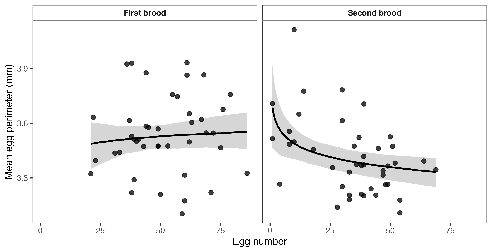
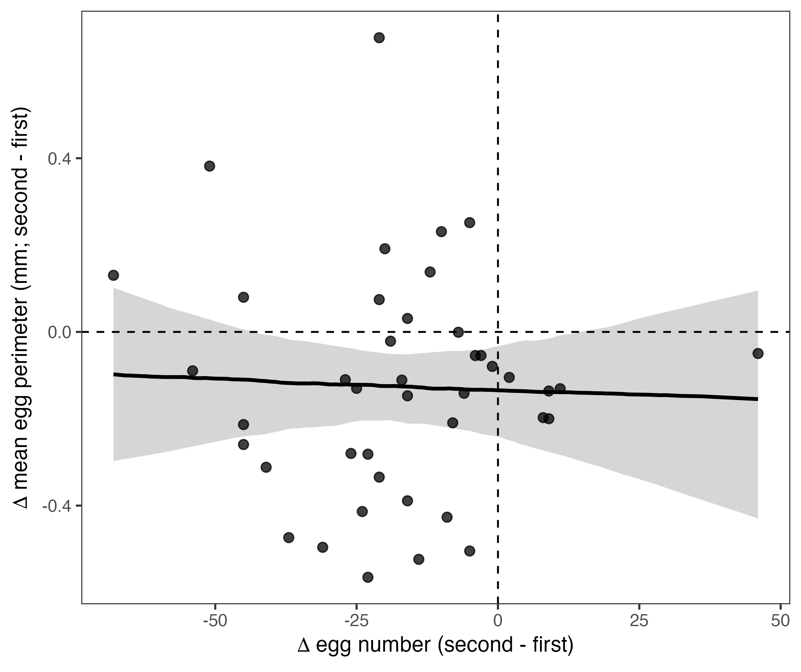

```{r}
#| label: setup-analysis
#| include: false
#| warning: false
#| message: false

candidate_scripts <- c(
  "scripts/earwig_tradeoff_reanalysis_submission.R",
  "earwig_tradeoff_reanalysis_submission.R",
  "scripts/earwig_tradeoff_reanalysis_final.R",
  "earwig_tradeoff_reanalysis_final.R",
  "scripts/earwig_tradeoff_reanalysis_revised.R",
  "earwig_tradeoff_reanalysis_revised.R",
  "scripts/earwig_tradeoff_reanalysis.R",
  "earwig_tradeoff_reanalysis.R"
)

script_path <- candidate_scripts[file.exists(candidate_scripts)][1]

if (is.na(script_path)) {
  stop(
    "Place earwig_tradeoff_reanalysis_submission.R in scripts/ or the project root."
  )
}

source(script_path, local = knitr::knit_global())

ss <- function(b, column, digits = 2) {
  value <- summary_stat[[column]][as.character(summary_stat$brood) == b]
  fmt(value, digits)
}

bs <- function(b, column, digits = 2) {
  value <- brood_scaling[[column]][as.character(brood_scaling$brood) == b]
  fmt(value, digits)
}

chg_n <- function(column) {
  as.integer(change_direction_summary[[column]][1])
}

chg_pct <- function(column, digits = 0) {
  fmt(100 * change_direction_summary[[column]][1], digits)
}

num_value <- function(x, term, column = "estimate") {
  x[[column]][match(term, x$term)]
}
```

\newpage

# Abstract

Life-history theory predicts that females producing more offspring should invest less in each offspring, yet variation in resource acquisition can obscure this size–number trade-off. I measured egg number and mean egg perimeter in two successive broods produced by 42 female European earwigs (*Forficula auricularia*). A Bayesian bivariate mixed model separated among-female from within-female covariance after accounting for brood order and structural size, and a complementary size-adjusted model tested whether the among-female relationship differed between reproductive bouts. Females produced fewer eggs with smaller mean perimeters in their second brood, and the pooled association was near zero. The persistent among-female correlation across broods was estimated with insufficient precision for a firm conclusion. In contrast, the within-female residual correlation was negative: after accounting for the brood-order shift, structural size, and stable differences among females, high egg production was associated with small egg perimeters. The among-female pattern also differed across reproductive contexts. Egg number was unrelated to egg perimeter among females in first broods, whereas females producing more eggs in their second brood produced eggs with smaller perimeters. The second-brood relationship was robust to how egg number was standardized, though the precision of the brood difference depended somewhat on scaling. Sensitivity analyses based on proportional changes in egg number were directionally consistent with within-female compensation; analyses of absolute changes were not. Thus, a negative egg number–perimeter relationship consistent with a size–number trade-off was most clearly expressed among females during the second reproductive bout, with additional, scale-dependent evidence of within-female compensation across broods.

# Introduction

Life-history theory predicts that organisms must allocate finite resources among competing fitness components. A central example is the offspring size–number trade-off: for a fixed reproductive budget, producing more offspring should reduce the resources available to each offspring [@smith1974; @roff1992a; @stearns1992]. Because larger eggs often improve offspring performance, selection is expected to favour an allocation of reproductive resources that balances offspring size against offspring number [@clutton-brock1991; @fox2000]. Nevertheless, empirical studies frequently find weak, absent, or even positive phenotypic relationships between these traits [@bernardo1996; @fox2000; @hargitai2005].

A weak phenotypic relationship does not necessarily imply that allocation is unconstrained. Females differ both in the total resources they acquire and in how they allocate those resources [@vannoordwijk1986; @houle1991; @careau2017]. When variation in acquisition is large, well-resourced females may produce both more and larger offspring, masking a negative allocation relationship. Repeated measures can help separate persistent covariance among females from covariance expressed within females across reproductive bouts. In a multivariate mixed model, covariance between female-level effects describes whether females that generally produce more eggs also generally produce larger or smaller eggs. Residual covariance assesses whether departures in egg number and egg size covary within females after accounting for systematic differences between bouts and persistent female effects [@careau2017].

The size–number relationship may also vary among reproductive contexts. Females preparing a first brood after a long period of resource acquisition in the field may differ greatly in resource state, age, mating history, and environmental experience. Such heterogeneity can obscure allocation constraints. A later brood produced after females experience a more common environment may reduce variation in recent resource acquisition, potentially making a trade-off easier to detect. Alternatively, later reproduction may occur under stronger physiological or energetic limitation, altering how females divide resources between offspring size and number. Pooling reproductive bouts could therefore conceal biologically meaningful differences in the expression of the trade-off.

The European earwig, *Forficula auricularia*, provides a useful system for examining these possibilities. Females lay discrete clutches and provide extended maternal care [@staerkle2008; @meunier2024]. In Québec populations, most females produce a single clutch under field conditions, although a second clutch can be induced under favourable laboratory conditions [@tourneur1992; @tourneur2018]. Earwigs therefore do not produce long sequences of broods: two broods encompass the biologically relevant repeated reproductive sequence under the conditions studied. Previous work found no consistent phenotypic relationship between egg number and egg mass [@koch2014] but did not examine whether the relationship differed across reproductive bouts or hierarchical levels.

I used two successive broods from the same females to address three related questions. First, is negative egg size–number covariance expressed persistently among females or within females across bouts after accounting for the average brood-order shift? Second, does the among-female relationship between egg size and number differ between first and second broods? Third, do females showing larger changes in egg number show compensatory changes in egg size? The central goal was not to assume that the two broods represented identical environments, but to determine how females allocated the resources available to them during the reproductive sequence and whether that allocation relationship depended on reproductive bout.

# Methods

I collected 351 adult female earwigs in September and October 2024 from Parc Outremont, an urban park in Montréal, Canada. Females were brought to the laboratory, assigned unique identification codes, and housed individually in 90-mm Petri dishes containing a thin layer of moist sand. Each female received a cotton-plugged water vial and TetraMin Tropical fish flakes *ad libitum*. Females were maintained at 10 °C in constant darkness. Of the 351 females, 238 laid a first brood. Because of logistical constraints, 54 of these females were selected for production of a second brood, and all 54 subsequently produced one. The selected females laid their first broods between 29 October and 11 December 2024, encompassing the full observed span of first-brood oviposition dates. For 12 females, the second brood was discovered more than 12 h after laying and was therefore excluded to standardize the interval between oviposition and photography. The final analytical sample consequently comprised 42 females for which both broods were discovered and photographed within approximately 12 h of laying.

Females were checked for oviposition each morning when photography could be completed within the standardized time window. Because oviposition occurred during the night, eggs discovered during these checks had been laid no more than approximately 12 h earlier; females and eggs remained at 10 °C in constant darkness during this interval. Broods discovered more than 12 h after laying were excluded because the elapsed time before photography exceeded the standardized window. When eggs were discovered within this window, I recorded the date, removed all recovered eggs from the sand, and placed them on filter paper in a new Petri dish. All recovered eggs were photographed and included because fertilisation and viability could not be determined visually. Eggs were photographed at 0.68× magnification under a Leica S6D stereomicroscope using Enersight software, which added a scale bar to each photograph, and were then discarded.

To permit a second reproductive bout, females that had completed their first brood were transferred to 23 °C under a 12 h light:12 h dark cycle. Each dish contained water, fish flakes, and a shelter constructed from four 4-cm straws. After two weeks, each female was paired with a haphazardly selected stock male for one week and then with a second stock male for another week. Stock males were drawn from a pool of 20 adults collected from the same Parc Outremont population and maintained communally in a terrarium with *ad libitum* food and water at 23 °C; individual males could therefore have mated with more than one female during the experiment. Females were subsequently returned to 10 °C and constant darkness until they produced their second brood, approximately one month after the first. Second-brood eggs were collected and photographed using the same procedure. Females were euthanised by freezing after the second brood, and their pronota were photographed under the stereomicroscope.

I measured the perimeter of every egg three times in Fiji [@schindelin2012]. I estimated measurement repeatability separately for each brood using egg identity as the grouping factor. Measurement repeatability was high in both first broods (*R* = 0.977, 95% CI [0.976, 0.979]) and second broods (*R* = 0.93, 95% CI [0.926, 0.937]). I therefore averaged the three measurements for each egg and calculated mean egg perimeter for each female and brood. Egg number was the number of photographed eggs in each clutch. Perimeter is a repeatable measure of egg dimensions but is not a direct measure of egg mass, volume, or energetic content; throughout, “egg size” is used operationally to refer to egg perimeter.

I also measured each female's pronotum length three times to the nearest 0.001 mm, with measurements made in separate sessions, and estimated repeatability using female identity as the grouping factor. Pronotum measurements were highly repeatable (*R* = 0.98, 95% CI [0.97, 0.99]), so I used the mean value as an index of adult structural size. Pronotum length was preferred to body mass because adult earwigs do not molt and pronotum dimensions were therefore fixed before collection and could not be altered by the intervening reproductive or laboratory conditions [@meunier2024].

### Statistical analysis

All analyses were conducted in R using *brms* and the *cmdstanr* backend. Egg number and mean egg perimeter were log-transformed for the primary covariance analyses because proportional differences are biologically relevant to reproductive allocation and because egg number was right-skewed. Both transformed traits were standardized to means of zero and standard deviations of one. Pronotum length was also log-transformed and standardized. Because structural body size could influence both the number of eggs a female produces and egg dimensions, standardized log pronotum length was included as an additive covariate in the primary models. Because the two reproductive bouts differed simultaneously in temperature, photoperiod, female age, remating history, and the physiological consequences of prior reproduction, the brood-order term in all models captures the net effect of these co-varying differences rather than any single experimentally controlled factor; no attempt is made to attribute brood-order effects to a specific cause.

I first described the unpartitioned association using Pearson correlations. Confidence intervals were obtained by resampling females, thereby retaining the paired brood structure in the pooled analysis. I calculated a pooled correlation and separate correlations for first and second broods.

The primary hierarchical analysis was a Bayesian bivariate Gaussian mixed model. Standardized log egg number and standardized log mean egg perimeter were fitted jointly as response variables. Brood order and standardized log pronotum length were included as fixed effects in each submodel, and female identity was included as a correlated random intercept across responses. The correlation between female intercepts estimated persistent among-female covariance across broods conditional on structural body size. The residual correlation estimated average within-female covariance after accounting for the brood-order shift, structural body size, and persistent female differences. This residual correlation is a jointly estimated model parameter rather than a directly observed change score, and one correlation was estimated across both reproductive contexts.

I next tested whether the size-adjusted among-female relationship differed between reproductive bouts. Standardized log mean egg perimeter was predicted by brood, standardized log egg number, their interaction, and standardized log pronotum length, with female identity included as a random intercept. Log egg number was standardized once using its pooled mean and standard deviation, so the predictor had the same scale in both broods and the interaction directly compared brood-specific slopes. Each brood-specific slope therefore describes an among-female association within that reproductive bout. As a sensitivity analysis, I refitted the model after standardizing log egg number separately within each brood.

To express the second-brood relationship in original units, I used posterior predictions from the primary model for an average-sized female producing either 20 or 40 eggs. These round, representative values span a substantial portion of the observed second-brood distribution and both lie within its observed range. Predictions were back-transformed from standardized log egg perimeter to millimetres.

I used two additional sets of sensitivity analyses to examine compensation within females. First, I fitted within–between regressions in which egg number was decomposed into each female’s mean and each brood's deviation from that mean [@vandepol2009]. Separate models used egg number and mean egg perimeter on their original scales or after log-transforming both traits, thereby representing absolute and proportional differences, respectively. Standardized log pronotum length was included as a covariate to condition the between-female slope on structural size, consistent with the primary models; the within-female slope is unaffected by pronotum because that trait does not vary within females. These were univariate egg-perimeter models and therefore did not duplicate covariance parameters in a joint response model. Second, because each female produced exactly two broods, I calculated changes in egg number and egg perimeter from the first to the second brood and regressed the change in egg perimeter on the change in egg number on both absolute and log scales. A negative slope indicates that females showing a relatively larger increase, or smaller decline, in egg number tended to show a relatively greater decline in egg perimeter. Pronotum length was not included in the change-score models because the change-score differences out all stable female characteristics — including structural size — by construction.

Regression coefficients in the bivariate model were assigned Normal(0, 1) priors and those in the univariate models were assigned Normal(0, 0.7) priors. Intercepts were assigned Normal(0, 1) priors, standard deviations Student-*t*(3, 0, 1) priors, and correlation matrices LKJ(2) priors. The bivariate model was run using four chains of 6,000 iterations, including 2,000 warm-up iterations. Each univariate model was run using four chains of 5,000 iterations, including 1,500 warm-up iterations. All models used `adapt_delta = 0.99` and a maximum tree depth of 15. Convergence and sampling quality were evaluated using trace plots, effective sample sizes, $\hat{R}$, divergent-transition counts, and maximum-tree-depth diagnostics. Model adequacy was evaluated using posterior predictive checks. Estimates are posterior medians and equal-tailed 95% credible intervals (CrI); for focal directional relationships, I also report the posterior probability that the parameter was negative.

# Results

Focal posterior estimates from the covariance, brood-specific, change-score, and within–between models are summarized in @tbl-focal-results.

### Changes between reproductive bouts

All estimates from the primary bivariate and brood-specific models were adjusted for standardized log pronotum length. First broods contained `r ss("one", "mean_number")` ± `r ss("one", "se_number")` eggs (mean ± SE), whereas second broods contained `r ss("two", "mean_number")` ± `r ss("two", "se_number")` eggs. Mean egg perimeter declined from `r ss("one", "mean_size")` ± `r ss("one", "se_size")` mm in first broods to `r ss("two", "mean_size")` ± `r ss("two", "se_size")` mm in second broods. In the bivariate model, standardized log egg number was lower in second broods ($\beta$ = `r est(biv_brood_summary, "egg_number_brood")`, 95% CrI [`r lcl(biv_brood_summary, "egg_number_brood")`, `r ucl(biv_brood_summary, "egg_number_brood")`]), as was standardized log egg perimeter ($\beta$ = `r est(biv_brood_summary, "egg_size_brood")`, 95% CrI [`r lcl(biv_brood_summary, "egg_size_brood")`, `r ucl(biv_brood_summary, "egg_size_brood")`]). Egg number declined in `r chg_n("n_number_decline")` of `r chg_n("n_females")` females (`r chg_pct("prop_number_decline")`%), egg perimeter declined in `r chg_n("n_size_decline")` females (`r chg_pct("prop_size_decline")`%), and both traits declined in `r chg_n("n_both_decline")` females (`r chg_pct("prop_both_decline")`%).

### Hierarchical covariance across broods

When both broods were pooled without accounting for hierarchy or reproductive context, the raw egg number–perimeter correlation was close to zero (*r* = `r est(raw_cor_summary, "pooled")`, 95% CI [`r lcl(raw_cor_summary, "pooled")`, `r ucl(raw_cor_summary, "pooled")`]). Examined separately, the raw association was weakly positive in first broods (*r* = `r est(raw_cor_summary, "first")`, 95% CI [`r lcl(raw_cor_summary, "first")`, `r ucl(raw_cor_summary, "first")`]) and negative in second broods (*r* = `r est(raw_cor_summary, "second")`, 95% CI [`r lcl(raw_cor_summary, "second")`, `r ucl(raw_cor_summary, "second")`]). The persistent among-female correlation across broods was highly uncertain (*r* = `r est(biv_cor_summary, "among_female")`, 95% CrI [`r lcl(biv_cor_summary, "among_female")`, `r ucl(biv_cor_summary, "among_female")`]). The interval encompassed moderately strong relationships in either direction, so the data could not establish whether females consistently differed along an egg number–perimeter allocation axis. The bivariate model estimated a negative residual correlation at the within-female level, averaged across reproductive bouts (*r* = `r est(biv_cor_summary, "within_female")`, 95% CrI [`r lcl(biv_cor_summary, "within_female")`, `r ucl(biv_cor_summary, "within_female")`]; *P*[*r* < 0] = `r pneg(biv_cor_summary, "within_female")`). After accounting for brood order, structural size, and persistent female differences, this model was therefore consistent with negative within-female covariance.

### Brood-specific among-female relationships

The pooled association concealed contrasting brood-specific patterns (@fig-context). The standard deviation of log egg number was `r bs("one", "sd_log_n", 2)` in first broods and `r bs("two", "sd_log_n", 2)` in second broods; the primary model nevertheless used a single pooled standard deviation so that both slopes were expressed on the same predictor scale. In first broods, the size-adjusted among-female slope was `r est(context_slope_summary, "first")` (95% CrI [`r lcl(context_slope_summary, "first")`, `r ucl(context_slope_summary, "first")`]; *P*[$\beta$ < 0] = `r pneg(context_slope_summary, "first")`), providing no evidence that females producing more eggs produced smaller eggs. In second broods, the slope was negative ($\beta$ = `r est(context_slope_summary, "second")`, 95% CrI [`r lcl(context_slope_summary, "second")`, `r ucl(context_slope_summary, "second")`]; *P*[$\beta$ < 0] = `r pneg(context_slope_summary, "second")`). The posterior distribution assigned `r fmt(100 * num_value(context_slope_summary, "second_minus_first", "p_negative"), 1)`% probability to the second-brood slope being more negative than the first, although the 95% CrI for the difference slightly included zero ($\Delta\beta$ = `r est(context_slope_summary, "second_minus_first")`, 95% CrI [`r lcl(context_slope_summary, "second_minus_first")`, `r ucl(context_slope_summary, "second_minus_first")`]). When log egg number was instead standardized separately within each brood, the second-brood slope was `r est(context_scaling_sensitivity_summary, "second")` (95% CrI [`r lcl(context_scaling_sensitivity_summary, "second")`, `r ucl(context_scaling_sensitivity_summary, "second")`]) and the difference between slopes was more precisely negative ($\Delta\beta$ = `r est(context_scaling_sensitivity_summary, "second_minus_first")`, 95% CrI [`r lcl(context_scaling_sensitivity_summary, "second_minus_first")`, `r ucl(context_scaling_sensitivity_summary, "second_minus_first")`]; *P*[$\Delta\beta$ < 0] = `r pneg(context_scaling_sensitivity_summary, "second_minus_first")`). Thus, the negative second-brood relationship was robust, whereas the precision of the contrast between brood-specific slopes depended somewhat on standardization.

On the original measurement scale, the model predicted that an average-sized female producing 20 eggs in her second brood would produce eggs with a mean perimeter of `r est(second_brood_contrast_summary, "eggs_20", 3)` mm (95% CrI [`r lcl(second_brood_contrast_summary, "eggs_20", 3)`, `r ucl(second_brood_contrast_summary, "eggs_20", 3)`]), compared with `r est(second_brood_contrast_summary, "eggs_40", 3)` mm (95% CrI [`r lcl(second_brood_contrast_summary, "eggs_40", 3)`, `r ucl(second_brood_contrast_summary, "eggs_40", 3)`]) at 40 eggs. This corresponds to a predicted decrease of `r fmt(-num_value(second_brood_contrast_summary, "difference_40_minus_20"), 3)` mm (95% CrI [`r fmt(-num_value(second_brood_contrast_summary, "difference_40_minus_20", "upper"), 3)`, `r fmt(-num_value(second_brood_contrast_summary, "difference_40_minus_20", "lower"), 3)`]), or approximately `r fmt(100 * -num_value(second_brood_contrast_summary, "difference_40_minus_20") / num_value(second_brood_contrast_summary, "eggs_20"), 1)`% of the predicted perimeter at 20 eggs.

### Within-female compensation and sensitivity to scale

Most females moved toward both lower egg number and lower egg perimeter in their second brood (@fig-change), but the magnitude of these changes was not clearly related on the absolute scale ($\beta$ = `r est(change_summary, "raw")`, 95% CrI [`r lcl(change_summary, "raw")`, `r ucl(change_summary, "raw")`]; *P*[$\beta$ < 0] = `r pneg(change_summary, "raw")`). On the proportional log scale, the change-score slope was more negative but remained uncertain ($\beta$ = `r est(change_summary, "log")`, 95% CrI [`r lcl(change_summary, "log")`, `r ucl(change_summary, "log")`]; *P*[$\beta$ < 0] = `r pneg(change_summary, "log")`).

The within–between regressions showed the same scale dependence. The within-female slope was centered near zero on the absolute scale ($\beta$ = `r est(wb_summary, "raw_within")`, 95% CrI [`r lcl(wb_summary, "raw_within")`, `r ucl(wb_summary, "raw_within")`]) but was more negative on the proportional scale ($\beta$ = `r est(wb_summary, "log_within")`, 95% CrI [`r lcl(wb_summary, "log_within")`, `r ucl(wb_summary, "log_within")`]; *P*[$\beta$ < 0] = `r pneg(wb_summary, "log_within")`). The corresponding among-female slopes were negative but uncertain on both the absolute and proportional scales. Together, the sensitivity analyses were directionally consistent with negative within-female covariance when egg-number differences were expressed proportionally, but they did not provide scale-independent evidence of compensation.

All models sampled well. Across the seven fitted models, the maximum $\hat{R}$ was `r fmt(max(model_diagnostics$max_rhat, na.rm = TRUE), 2)`; the minimum bulk and tail effective sample sizes were `r fmt(min(model_diagnostics$min_bulk_ess, na.rm = TRUE), 0)` and `r fmt(min(model_diagnostics$min_tail_ess, na.rm = TRUE), 0)`, respectively, and there were no divergent transitions or iterations that reached the maximum tree depth.

# Discussion

The expression of the egg size–number trade-off depended on reproductive context and the hierarchical level examined. Egg number and mean egg perimeter were essentially uncorrelated when all observations were pooled. Partitioning the data revealed a more complex pattern: the bivariate model estimated a negative residual correlation at the within-female level, whereas the size-adjusted among-female relationship was negative for second broods but not for first broods. Persistent among-female covariance across both broods remained too imprecisely estimated to establish that females consistently differed along a common allocation axis.

The brood-specific result provides the clearest evidence that the trade-off was context-dependent. Among females producing first broods, egg number was not detectably related to egg perimeter. Among females producing second broods, however, larger clutches contained smaller eggs. The negative second-brood slope was robust to whether log egg number was standardized using a common pooled standard deviation or separate brood-specific standard deviations, and it remained after accounting for female pronotum length. Evidence that the second-brood slope was more negative than the first was strong but somewhat sensitive to standardization: the common-scale contrast had high posterior support but a 95% credible interval that slightly overlapped zero, whereas the brood-specific standardized contrast was more precisely negative. The central conclusion is therefore that a negative relationship was evident in second broods but not first broods, rather than that the magnitude of the difference between slopes was known with equal precision under every scaling choice. Maternal investment in egg size and clutch size often changes with environmental conditions, reproductive timing, female state, and clutch sequence [@bernardo1996; @fox2000; @hargitai2005], and previous work on European earwigs likewise found that associations among egg number, egg mass, and maternal investment were not uniform across reproductive circumstances [@koch2014].

The magnitude of the second-brood association was modest on the original scale. Comparing the illustrative values for 20 and 40 eggs was associated with an approximately 0.055 mm (1.6%) reduction in the predicted mean egg perimeter. The fitness consequences of a difference of this magnitude are unknown because offspring performance was not measured, and perimeter cannot be translated directly into egg volume or energetic content without information about egg shape. The analysis therefore establishes a modest morphological relationship without demonstrating its functional importance.

Reproductive bout was inseparable from several other differences between observations. Between broods, females experienced a shift in temperature and photoperiod, a shared feeding environment, remating, advancing age, and the physiological consequences of having already produced one clutch. The study therefore establishes that the egg number–perimeter relationship differed between the two reproductive contexts, but it cannot determine whether that change resulted from reproductive sequence, environmental standardization, altered female state, or some combination of these factors.

Two non-exclusive explanations deserve equal consideration. First, heterogeneity in resource acquisition may have obscured the relationship in first broods. Females collected from the field likely differed in accumulated resources and environmental history, and acquisition variance can weaken or reverse phenotypic trade-offs if well-resourced females produce both more and larger offspring [@vannoordwijk1986; @dejong1992; @reznick2000]. Common laboratory conditions before the second brood may have reduced some of this heterogeneity. Second, the later reproductive bout may have imposed stronger physiological or energetic constraints. State-dependent models predict that allocation depends on current reserves and physiological capacity [@mcnamara1996; @houston1999], and physiological mechanisms can alter both total reproductive investment and the apparent strength of trade-offs [@zera2001a; @ricklefs2002]. Second broods contained both fewer and smaller eggs, and declining ovariole function has been proposed to restrict egg production after the first clutch in this population [@tourneur1992]. The present data cannot discriminate between reduced acquisition variance and stronger physiological constraint.

The average decline in both traits clarifies how total reproductive investment and allocation can operate simultaneously. Females did not compensate at the population mean for a lower second-brood egg number by producing larger eggs; mean egg perimeter also declined. Models of offspring size and number distinguish total reproductive effort from the division of that effort among offspring [@smith1974; @winkler1987]. A reduction in total effort can therefore cause egg number and egg dimensions to move in the same direction across reproductive bouts even while females face a negative relationship within a particular bout.

Evidence for compensation within females across bouts was more qualified. The bivariate model estimated a negative residual correlation, but this correlation was jointly estimated with other variance and covariance components and averaged across both reproductive contexts. Direct change-score and within–between analyses were also negative when changes in egg number were expressed proportionally, but their credible intervals included small positive effects; analyses of absolute differences were centered near zero. The three proportional-scale estimates therefore pointed in the same direction, but the strength of the evidence depended on model formulation and scale. It is also worth noting that, with exactly two observations per female, the within-female deviation in the within–between model is a linearly rescaled version of the change score; the two approaches are therefore mathematically near-equivalent and should not be treated as independent lines of evidence. The most defensible interpretation is that the data are consistent with negative within-female covariance, not that they demonstrate a universal within-female allocation rule [@vandepol2009; @careau2017; @westneat2020].

The study provides little information about persistent covariance among females across reproductive bouts. The broad posterior interval encompassed moderately strong negative and positive correlations. Consequently, the data cannot determine whether females consistently differ in the balance between egg number and egg dimensions across reproductive contexts. This limitation concerns persistent cross-bout covariance and does not negate the negative among-female relationship observed specifically within second broods. A larger sample of females would be needed to estimate persistent among-female covariance with useful precision.

The use of perimeter also limits the biological interpretation. Perimeter is a highly repeatable measure of egg dimensions, but it does not directly quantify egg mass, volume, composition, or energetic content, particularly if egg shape varies. The results therefore demonstrate relationships involving egg dimensions rather than energetic allocation per se. The slightly lower measurement repeatability in second broods remained high, and additional measurement error would generally add noise and reduce precision rather than generate a negative relationship. Nevertheless, future studies should explicitly measure egg mass, volume, and shape to more directly link the morphological relationship to maternal energetic investment [@bernardo1996; @fox2000].

The availability of only two broods is a biological feature of this system rather than an avoidable sampling deficiency. European earwig females produce discrete clutches and, in Québec populations, generally produce only one clutch under natural conditions; a second clutch is possible under favourable conditions, but long sequences of repeated broods are not characteristic of their reproductive biology [@tourneur1992; @tourneur2018; @meunier2024]. The two observations per female span the repeated reproductive sequence available under the study conditions. They are sufficient to estimate average covariance across bouts, but not variation among females in their allocation slopes.

More generally, the results illustrate why pooled phenotypic correlations can provide an incomplete picture of life-history trade-offs. Combining first broods with no detectable among-female relationship and second broods with a negative relationship produced an overall association near zero. Observed covariance reflects both acquisition and allocation and may therefore differ from the underlying resource-allocation relationship [@vannoordwijk1986; @houle1991; @stearns1989; @roff2007a]. Hierarchical and context-specific analyses are useful because they identify the biological level and setting at which covariance is expressed [@careau2017; @johnson2024]. Here, the strongest evidence concerns an among-female trade-off in egg dimensions during the second reproductive bout, while evidence for a general cross-bout within-female trade-off remains suggestive and scale-dependent.

Future work could manipulate resource availability before both broods while holding temperature, photoperiod, and mating history constant. Direct measurements of female energetic reserves, ovariole function, and resource intake would help distinguish reduced acquisition from physiological limitation [@zera2001a; @ricklefs2002]. Measuring egg mass, volume, and shape, in addition to perimeter, would more directly connect egg dimensions to maternal investment. For the present data, the most defensible conclusion is that the egg number–perimeter trade-off was clearly expressed among females in the second reproductive bout, absent among females in the first, and supported more cautiously within females across bouts when reproductive changes were considered proportionally.

# Availability of data and material

The data supporting this study are available through the Open Science Framework repository at https://osf.io/jrs28/overview?view_only=7a78f30e724b497ab3bb62ffa1c97e10.

# Code availability

The R code used to reproduce all analyses and figures will be available in the same Open Science Framework repository.

# Author contributions

CDK collected and analysed the data and wrote the manuscript.

# Funding

The study was funded by a Discovery Grant from the Natural Sciences and Engineering Research Council of Canada (NSERC).

# Ethics approval

Formal institutional animal ethics approval was not required because the study involved an invertebrate species.

# Competing interests

The author declares no competing interests.

# Acknowledgements

I thank Andréanne Nault and Clara Smythe for assistance with animal care and data collection. I also thank Denis Réale and Pierre-Olivier Montiglio for discussion and feedback.

\newpage

# References {.unnumbered}

::: {#refs}
:::

\newpage

## Tables


```{r}
#| label: tbl-focal-results
#| tbl-cap: "Posterior summaries of focal egg number–perimeter relationships. Estimates are correlations for the bivariate covariance model and standardized regression coefficients for the brood-specific, change-score, and within–between models. Brood-specific slopes are shown using both pooled and within-brood standardization of log egg number. Proportional sensitivity models use log-transformed traits. CrI, credible interval; P(<0), posterior probability that the estimate is negative."
#| echo: false
#| warning: false
#| message: false

table_1_flex
```


## Figures

::: {#fig-context}


Among-female relationships between egg number and mean egg perimeter within first and second broods. Points represent brood means for individual females. Lines show posterior median predictions from a Bayesian mixed model containing brood, pooled-standardized log egg number, their interaction, and standardized log pronotum length; shaded regions denote 95% credible intervals. Predictions are shown for a female of average structural size and are displayed on the original measurement scales, which causes the fitted relationships to appear curved after back-transformation. Egg number was not clearly associated with egg perimeter among females in first broods, whereas females producing more eggs produced smaller eggs in second broods.
:::

::: {#fig-change}


Within-female changes in egg number and mean egg perimeter between first and second broods. Each point represents one female, with changes calculated as the second brood minus the first brood; negative values indicate a decline between reproductive bouts. The line shows the posterior median relationship from the absolute-scale change-score model, and the shaded region denotes its 95% credible interval. Dashed lines indicate no change. Egg number declined in `r chg_n("n_number_decline")` of `r chg_n("n_females")` females, egg perimeter declined in `r chg_n("n_size_decline")`, and both traits declined in `r chg_n("n_both_decline")`; the magnitudes of the absolute changes were not clearly associated.
:::
