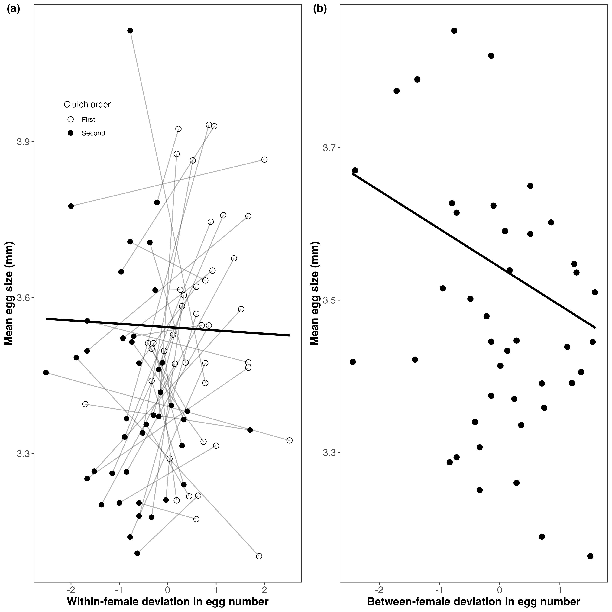
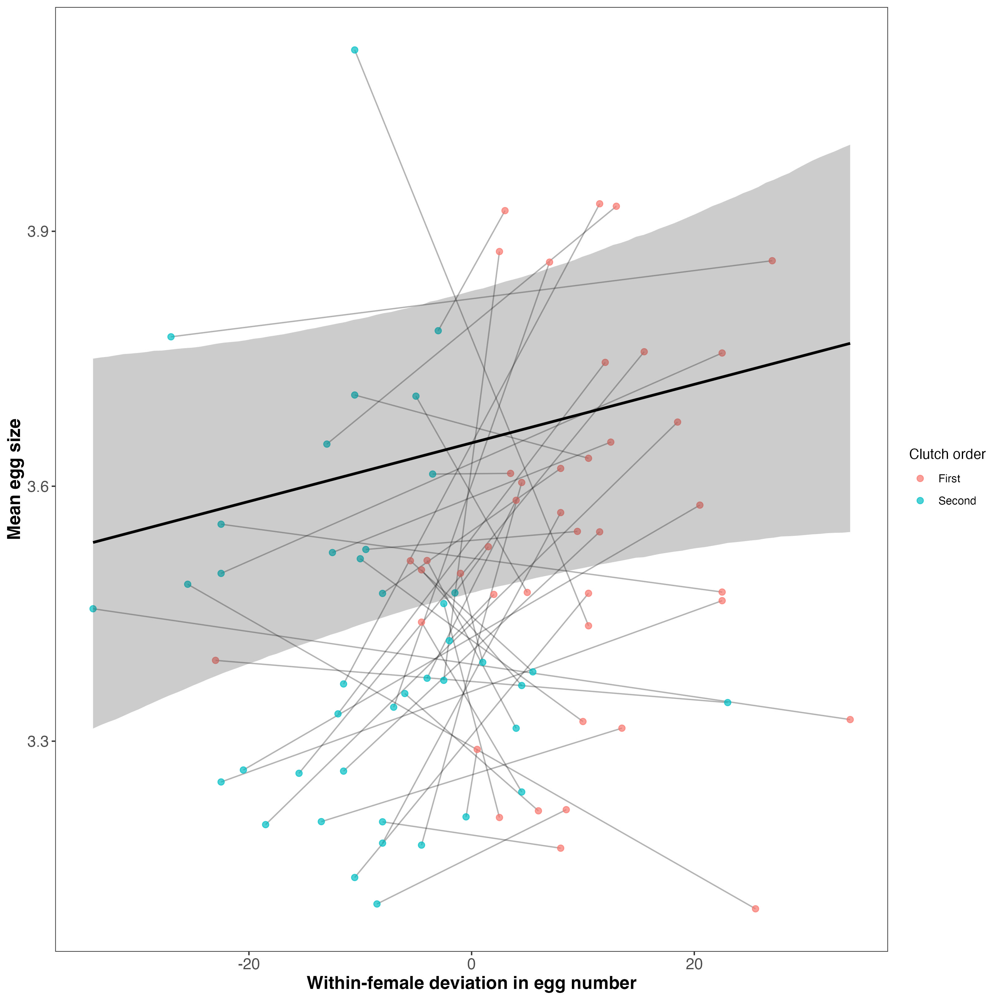
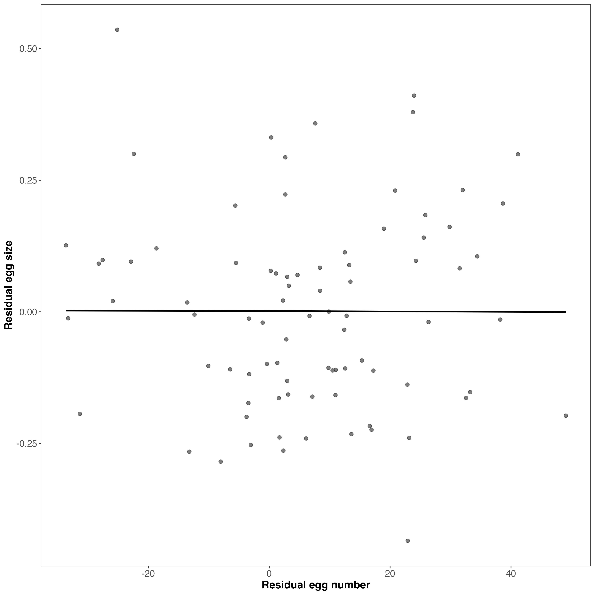
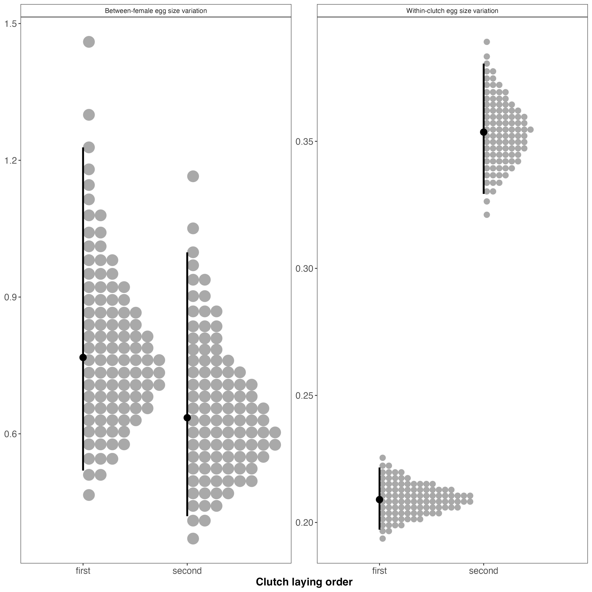

```{r echo=FALSE}
knitr::read_chunk('scripts/earwig_tradeoff.R')
```

```{r analysis, include=FALSE,echo=FALSE, warning=FALSE, results="hide"}
```

\newpage

# Abstract
Life history theory predicts that clutch and egg size trade off because both traits compete for the same limited resource pool. Tests of this prediction often show a positive phenotypic correlation, probably because some females acquire more resources than others and can produce more and larger eggs. To accurately assess whether a trade-off exists, it is necessary to examine within-individual correlations, since phenotypic correlations can be misleading. I addressed this issue using a multivariate mixed model to decompose the phenotypic correlation between egg number and size in European earwigs (*Forficula auricularia*) into among-female and within-female (residual) components. I found that earwigs do not trade off clutch and egg size; instead, these traits are positively correlated. This unexpected result is likely due to changes in ovarian structure after laying the first clutch, combined with how limited resources are allocated to fewer developing oocytes in the second clutch. Contrary to expectation, evidence suggests that the among-female correlation is negative. Additionally, I found that second clutches have greater variation in egg size than first clutches, although the average variation in egg size among females is similar across clutches. Further research is needed to clarify the proximate reasons for the tendency of second clutches to have fewer and smaller eggs than first clutches, as well as to identify the proximate and ultimate causes of the greater variation in egg size in second clutches. 

\newpage

# Introduction
Maternal investment is allocated between offspring fitness and quantity, with larger eggs generally enhancing offspring fitness [@clutton-brock1991]. A limited pool of reproductive resources, therefore, requires females to balance investment between the number and quality of eggs produced during a reproductive cycle [@smith1974; @roff1992a; @fox2000; see also @parker1982]. However, these traits do not always trade off against each other [@cavaleiro2014; @roff1992a; @bernardo1996; @stearns1992; @hargitai2005; @fox2000]. Or at least, they do not appear to trade off. Positive correlations between traits that should otherwise covary negatively could be due to how individuals acquire resources and subsequently allocate them among competing traits [@reznick2000]. Van Noordwijk and DeJong [-@vannoordwijk1986; see also @reznick2000] explained that whether I observe positive or negative correlations between fitness-related traits (e.g., egg number or egg size) depends on whether some individuals in a population can acquire more resources than others and thus possess a larger resource pool that can be partitioned to competing traits. Consequently, such variation in acquisition can lead to a positive correlation between traits (e.g., egg number vs. egg size) when measured across individuals within a population, while masking allocation trade-offs within individuals [i.e. Simpson’s Paradox, @simpson1951], assuming that all individuals follow a similar allocation strategy.  This means that females that acquire more reproductive resources can produce more and larger eggs, but must nevertheless trade off size and number. 

Careau and Wilson [-@careau2017] argue that revealing a trade-off when contrasting processes occur at the among- and within-individual levels requires partitioning the phenotypic correlation between two competing traits into its among- and within-individual components. This can be achieved by repeatedly measuring traits of interest (i.e. egg number and size) for a group of individuals and then using multivariate mixed models to estimate the among- and within-individual correlations. To my knowledge, no study has yet adopted this approach to show that females indeed trade off egg number and size, despite these traits positively correlating across a population of females. I use the approach of Careau and Wilson [-@careau2017] here to test the hypothesis that European earwigs (*Forficula auricularia*) trade off clutch and egg size. *F. auricularia* is an ideal insect for testing this hypothesis because females lay a single clutch of eggs in a subterranean burrow within a short period of time (i.e. hours) [@meunier2024].  Females care for eggs and the nymphs for up to 2 weeks post-hatching [@meunier2024; @staerkle2008].  Earwigs in Quebec, Canada, are semelparous because the harsh environmental conditions extend the incubation and egg-care period beyond the point at which a second clutch is possible [@tourneur2018]. However, females can be induced to lay a second clutch under optimal laboratory conditions. I use this system to test the prediction that if resource allocation to clutches is greater among than within individuals, then the phenotypic and among-individual correlations between egg size and number will be positive, but the within-individual correlation will be negative because individual females trade off egg number for size. Second, I compare the average number and size of eggs across clutches to test whether fitness gains are optimised at a specific egg quantity or quality [e.g., @smith1974]. If so, one trait should not differ between clutches (e.g., egg number), whereas the other (e.g., egg size) is adjusted accordingly [@winkler1987]. Alternatively, females laying a second clutch may recognise their low residual reproductive value and, consequently, terminally invest in current reproduction by producing either more or larger eggs in this clutch [@clutton-brock1984]. Finally, I explore whether eggs in first and second clutches differ in their size variation at the among- and within-female (clutch) levels [e.g. @hargitai2005].

# Methods
I collected adult female earwigs (n=42) in September and October 2024 in an urban parks (Parc Outremont) in Montréal, Canada. All earwigs were brought into the laboratory, assigned a unique ID, and individually placed in a 90-mm-diameter Petri dish containing a thin layer of moist sand. Females were provided a cotton-plugged water vial and fed TetraMin Tropical fish flakes ad libitum. Females were maintained in an incubator (Percival) at 10°C in constant darkness.

Females were checked daily for oviposition. When a female laid eggs, I recorded the date and collected all eggs from the sand and placed them on filter paper in a new Petri dish. The eggs were then photographed under a Leica S6D stereo microscope (Leica Microsystems Inc., Concord, ON, Canada) at 0.68x magnification using Enersight software (Leica Microsystems Inc., Concord, ON, Canada), which automatically adds a scale bar to the photo. Eggs were then discarded.

To stimulate females to lay a second clutch of eggs, I recreated a brief period of spring where they were allowed to accumulate resources for egg production and replenish their sperm stores. To achieve this, females that had recently oviposited were placed in a new Petri dish containing a cotton-plugged water vial, TetraMin Tropical fish flakes, and a shelter consisting of four 4 cm-long pieces of paper straw  (Blowholes, Markham, Canada) glued together. These Petri dishes were placed in a 23 °C incubator with a 12L:12D light: dark cycle. Females were maintained under these conditions for two weeks, at which time a haphazardly chosen stock male from our colony was placed with her. The pair was kept together for a week, after which a new stock male replaced the original male, and that pair was kept together for another week. Females were then transferred to the 10 °C incubator and treated as previously until they laid their second clutch, at which point their eggs were photographed. Females were euthanised by freezing after laying their second clutch, and their pronotum was photographed as described above. Females were then weighed to the nearest 0.01 mg using a Sartorius Secura 224-1S analytical balance. Females were weighed three times, with each weighing bout separated by four days. I used Fiji image analysis software [@schindelin2012] to measure the length of the female pronotum and the perimeter of each egg to the nearest 0.001 mm. Both traits were measured three times, with each measurement separated by 4 days.

### Statistical analysis
I calculated the repeatability of the body mass, pronotum length and egg perimeter measurements using the R package *rptR* [@stoffel2017]. I entered the trait of interest as the response variable, female ID as a random effect, and assumed a Gaussian distribution. Each analysis was based on 1000 bootstrap samples. The measurements of my two morphological traits were highly repeatable (pronotum length: *R* [95% CI] = `r myround(rep1$R, 2)` [`r myround(rep1$CI_emp[1,1],2)`, `r myround(rep1$CI_emp[1,2],2)`]; body mass: *R* [95% CI] = `r myround(rep2$R, 2)` [`r myround(rep2$CI_emp[1,1],3)`, `r myround(rep2$CI_emp[1,2],3)`]); therefore, I used each female’s mean value for each trait where necessary. Because egg perimeter was highly repeatable in both clutches (first clutch: *R* [95% CI] = `r myround(rep3$R,3)` [`r myround(rep3$CI_emp[1,1],3)`, `r myround(rep3$CI_emp[1,2],3)`]; second clutch: *R* [95% CI] = `r myround(rep4$R, 2)` [`r myround(rep4$CI_emp[1,1],3)`, `r myround(rep4$CI_emp[1,2],3)`] ), I calculated each egg's average perimeter and then used these values to calculate the mean egg size for each clutch for each female. 

To reduce the two correlated measures of body size (pronotum length and body mass) to a single structural size metric, I performed a principal components analysis (PCA) on the correlation matrix of standardized variables using the prcomp function in the R stats package [@r2013]. The first principal component (PC1) explained 60.8% of the total variance and was used as an index of structural body size. In addition, female body condition was estimated using the scaled mass index (SMI) following Peig and Green [-@peig2009; -@peig2010; see also @kelly2014], which standardizes body mass relative to structural size (pronotum length).

All subsequent analyses were conducted in a Bayesian framework using the *brms* package [@burkner2017] in R. Models were fitted using Hamiltonian Monte Carlo sampling with four independent chains and 4,000 iterations per chain. Weakly informative priors were specified for all parameters to regularize estimation while remaining minimally restrictive. Convergence was evaluated using the potential scale reduction factor ($\hat{R} \approx 1.00$), effective sample sizes (bulk and tail ESS), and visual inspection of trace plots. All reported parameters met standard convergence criteria. Unless otherwise noted, parameter estimates are presented as posterior means with 95% credible intervals (CrIs), and effects were considered supported when CrIs did not include zero.

To test whether egg size and egg number differed between first and second clutches, I fitted a multivariate Bayesian mixed-effects model. Mean egg size was modelled assuming a Gaussian error distribution with an identity link, whereas egg number was modelled using a Poisson distribution with a log link. Both traits were modelled jointly to account for covariance at the female level. For each response variable, the model included a fixed intercept and clutch order (first versus second clutch) as a fixed effect. Female identity was included as a random intercept for both egg size and egg number to account for repeated measures across clutches. The female-level random intercepts for the two traits were allowed to covary, thereby estimating the among-female variance–covariance structure between egg size and egg number. Residual correlations were not estimated (`set_rescor(FALSE)`), such that covariance between traits was modelled exclusively at the female level. This model therefore tested whether egg size and egg number differed systematically between clutches while accounting for repeated measures and among-female variation.

The raw phenotypic association between egg number and egg size was calculated using Pearson’s correlation coefficient across all observations. This estimate reflects the overall linear association between traits without accounting for repeated measures or hierarchical structure. To estimate among-female covariation, I calculated the Pearson correlation between female mean egg number and female mean egg size, averaging across broods. This approach isolates between-female covariance independent of within-female variation. To formally partition covariance into among-female and within-female components, I fitted a multivariate Gaussian mixed-effects model including egg size and egg number as joint responses. Female identity was included as a random intercept for both traits, and both female-level and residual correlations were estimated (`set_rescor(TRUE)`). The correlation between female-specific intercepts quantified the among-female association, whereas the residual correlation quantified the within-female (clutch-level) association between egg number and egg size.

To distinguish plastic from strategic effects, I followed van de Pol and Wright [-@vandepol2009] by decomposing egg number into two components. The within-female component represented the deviation of each observation from a female’s own mean egg number, and the between-female component represented each female’s mean egg number relative to the population mean. I then fitted alinear mixed-effects model with mean egg size as the response variable, including both components as fixed effects and female identity as a random intercept. In this framework, the within-female coefficient estimates the plastic allocation response, whereas the between-female coefficient estimates the among-female (strategic) association. Continuous predictors were standardized by centering them on their mean and scaling by their standard deviation. The within- and between-female components were each standardized using the mean and standard deviation of their respective distributions. When estimating standardized regression coefficients, the response variable was also scaled to have a standard deviation of one. Standardized coefficients therefore represent the expected change in egg size, measured in standard deviation units, associated with a one standard deviation change in the predictor.

To test whether females differed in their propensity to trade off egg size against egg number, I fitted a mixed-effects model allowing the within-female effect of egg number to vary among females. Mean egg size was included as the response variable, and egg number was partitioned into within-female and between-female components as described above. The within-female component was included as both a fixed effect and a random slope, while the between-female component was included as a fixed effect. Female identity was included as a random effect with both intercepts and random slopes for the within-female component. This parameterisation estimates among-female variation in within-female slopes and the correlation between intercepts and slopes, thereby quantifying heterogeneity in allocation strategies and testing whether females with larger average egg size differ systematically in the strength or direction of their within-female trade-off.

Because egg number and egg size both changed systematically across clutches, I tested whether clutch order explained the observed within-female association by adding clutch order as an additional fixed effect to the within–between model. In this extended model, mean egg size was predicted by the within-female deviation in egg number, the between-female mean egg number, and clutch order, while female identity was retained as a random intercept. If the within-female slope was reduced toward zero after including clutch order, this would indicate that the apparent within-female association was largely driven by parallel shifts between first and second clutches rather than by plastic allocation within females.

To compare clutch-specific variance components independently of random-slope parameterisation, I fitted a hierarchical Gaussian model in which female effects were estimated separately for first and second clutches. Scaled egg size was modelled as a function of clutch order with clutch-specific random intercepts for female identity. This parameterisation estimated separate among-female variance components for clutch 1 and clutch 2, as well as their correlation, allowing direct comparison of female-level variation across reproductive events. Residual standard deviations were also allowed to differ between clutches. Clutch-specific variance components were derived from posterior samples, and differences between clutches were evaluated using posterior contrasts.

Data were visualized using *ggplot* [@wickham2016].

# Results
### Effect of clutch order on egg size and number
Both egg number and egg size declined in the second clutch. In the multivariate Gaussian–Poisson model, egg size was smaller in clutch two ($\bar{x}$ ± SE = `r myround(summary.stat[2,2],2)` ± `r myround(summary.stat[2,5],2)`) relative to clutch one ($\bar{x}$ = `r myround(summary.stat[1,2],2)` ± `r myround(summary.stat[1,5],2)`; $\beta$ = `r myround(m_mv_2.sum[3,5],2)`, 95% CrI (`r myround(m_mv_2.sum[3,7],2)`, `r myround(m_mv_2.sum[3,8],2)`). Egg number also declined significantly (clutch one: $\bar{x}$ = `r myround(summary.stat[1,6],2)` ± `r myround(summary.stat[1,9],2)`; clutch two: $\bar{x}$ = `r myround(summary.stat[2,6],2)` ± `r myround(summary.stat[2,9],2)`; log-scale $\beta$ = `r myround(m_mv_2.sum[4,5],2)`, 95% CrI (`r myround(m_mv_2.sum[4,7],2)`, `r myround(m_mv_2.sum[4,8],2)`), corresponding to an approximate 34% reduction on the natural scale ($e^{`r myround(m_mv_2.sum[4,5], 3)`} \approx `r myround(exp(m_mv_2.sum[4,5]), 2)`$). Among-female variation remained detectable for both egg size (SD = 0.091, 95% CrI [0.009, 0.165]) and egg number (SD = 0.355, 95% CrI [0.273, 0.460]), indicating persistent heterogeneity across broods.

### Multilevel correlations between egg number and egg size
Across all observations, the raw Pearson correlation between egg number and egg size was weak and close to zero ($r_{raw}$ = `r myround(r_raw[1],2)`, 95% CI [`r myround(r_raw_ci95[1],2)`, `r myround(r_raw_ci95[2],2)`]), suggesting no clear phenotypic association when hierarchical structure was ignored. In contrast, the between-female Pearson correlation calculated from female means was moderate and negative ($r_{between}$ = `r myround(r_between[1],2)`, 95% CI [`r myround(r_between_ci95[1],2)`, `r myround(r_between_ci95[2],2)`]; @fig-one). Females that produced more eggs on average tended to lay smaller eggs. The multivariate Gaussian model partitioned covariation into among-female and residual components. After accounting for female identity, the residual (within-female) correlation between egg number and egg size was effectively zero and highly uncertain ($r_{within}$ = `r myround(r_within[1],4)`, 95% CI [`r myround(within_credible[1],2)`, `r myround(within_credible[2],2)`]; @fig-two). Thus, apparent phenotypic independence masked a moderate negative association among females but no detectable clutch-level trade-off within females.

### Within–between mixed-effects models
In the within–between mixed-effects model, egg size varied among females (random-intercept SD = `r myround(ran_int[1],2)`, 95% CrI [`r myround(ran_int[3],2)`, `r myround(ran_int[4],2)`]). The within-female effect of egg number on egg size was small and uncertain ($\beta_{W}$ = `r myround(fixef(fit.null)[2,1], 4)`, 95% CrI [`r myround(fixef(fit.null)[2,3], 4)`, `r myround(fixef(fit.null)[2,4], 4)`]; @fig-three). On the natural scale, this corresponds to an increase of approximately 0.027 units in egg size for every additional 10 eggs within a female — an effect that was not credibly different from zero. In contrast, the between-female effect was negative ($\beta_{B}$ = `r myround(fixef(fit.null)[3,1], 4)`, 95% CrI [`r myround(fixef(fit.null)[3,3], 4)`, `r myround(fixef(fit.null)[3,4], 4)`]; @fig-one). Females differing by 10 eggs in mean clutch size differed by approximately 0.038 units in egg size. Although the credible interval extended to zero, the posterior distribution was predominantly negative, consistent with a modest among-female trade-off.

Standardized coefficients reinforced the difference in magnitude between hierarchical levels. The standardized within-female effect was positive but uncertain ($\beta_{Wstandardized}$ = `r myround(std_effects_table[1,2],2)`, 95% CrI [`r myround(std_effects_table[1,3],2)`, `r myround(std_effects_table[1,4],2)`]), whereas the standardized between-female effect was negative and its credible interval did not overlap zero ($\beta_{Bstandardized}$ = `r myround(std_effects_table[2,2],2)`, 95% CrI [`r myround(std_effects_table[2,3],3)`, `r myround(std_effects_table[2,4],3)`]). Thus, the negative association was stronger and more consistent among females than within females.

Allowing within-female slopes to vary among females produced similar fixed-effect estimates  ($\beta_{W}$ = `r myround(fixef(m_rs)[2,1], 4)`, 95% CrI [`r myround(fixef(m_rs)[2,3], 4)`, `r myround(fixef(m_rs)[2,4], 4)`]; $\beta_{B}$ = `r myround(fixef(m_rs)[3,1], 4)`, 95% CrI [`r myround(fixef(m_rs)[3,3], 4)`, `r myround(fixef(m_rs)[3,4], 4)`]; @fig-three). Variation in within-female slopes was small (SD = `r myround(ran_int.slopes[1],4)`, 95% CrI [`r myround(ran_int.slopes[3],4)`, `r myround(ran_int.slopes[4],4)`]), and the intercept–slope correlation was highly uncertain (*r* = `r myround(ran_int.slopes.cor[1],2)`, 95% CrI [`r myround(ran_int.slopes.cor[3],2)`, `r myround(ran_int.slopes.cor[4],2)`]), indicating no strong evidence that females differed substantially in plastic allocation patterns.

Because both egg number and egg size declined across clutches, clutch order was included as an additional fixed effect to test whether it explained the weak positive within-female slope. When clutch order was accounted for, the within-female effect collapsed to zero ($\beta_{W}$ = `r myround(clutch_order_within[1], 4)`, 95% CrI [`r myround(clutch_order_within[3], 4)`, `r myround(clutch_order_within[4], 4)`]). Thus, there was no evidence that females plastically traded egg number against egg size within clutches; the apparent association in the initial model was entirely explained by parallel declines from clutch one to clutch two.

#### Egg size variation between females and within clutches
Egg size exhibited substantial variation at both the between-female and within-clutch levels  (@fig-four). Between-female variance was similar across reproductive events, with a median of `r myround(quantile(var_B1_alt, c(.025,.5,.975))[[2]],2)` (95% CrI: `r myround(quantile(var_B1_alt, c(.025,.5,.975))[[1]],2)`, `r myround(quantile(var_B1_alt, c(.025,.5,.975))[[3]],2)`) in first clutches and `r myround(quantile(var_B2_alt, c(.025,.5,.975))[[2]],2)` (95% CrI: `r myround(quantile(var_B2_alt, c(.025,.5,.975))[[1]],2)`, `r myround(quantile(var_B2_alt, c(.025,.5,.975))[[3]],2)`) in second clutches. The posterior median difference (second − first) was `r myround(quantile(diff_alt, c(.025,.5,.975))[[2]],2)` (95% CrI: `r myround(quantile(diff_alt, c(.025,.5,.975))[[1]],2)`, `r myround(quantile(diff_alt, c(.025,.5,.975))[[3]],2)`), and the posterior probability that between-female variance was greater in second clutches was `r myround(mean(diff_alt > 0),2)`, indicating no clear evidence of a difference. In contrast, within-clutch (egg-to-egg) variance was substantially higher in second clutches (median = `r myround(quantile(var_within_B2, c(.025,.5,.975))[[2]],2)` (95% CrI: `r myround(quantile(var_within_B2, c(.025,.5,.975))[[1]],2)`, `r myround(quantile(var_within_B2, c(.025,.5,.975))[[3]],2)`) than in first clutches (median = `r myround(quantile(var_within_B1, c(.025,.5,.975))[[2]],2)` (95% CrI: `r myround(quantile(var_within_B1, c(.025,.5,.975))[[1]],2)`, `r myround(quantile(var_within_B1, c(.025,.5,.975))[[3]],2)`). The posterior median difference was `r myround(quantile(diff_within, c(.025,.5,.975))[[2]],2)` (95% CrI: `r myround(quantile(diff_within, c(.025,.5,.975))[[1]],2)`, `r myround(quantile(diff_within, c(.025,.5,.975))[[3]],2)`), with a posterior probability of `r myround(mean(diff_within > 0),2)`, that within-clutch variance was greater in second clutches.

Egg size was highly repeatable in both broods, but repeatability was higher in first broods (R = `r myround(quantile(R_B2, c(.025,.5,.975))[[2]],2)` [95% CrI: `r myround(quantile(R_B2, c(.025,.5,.975))[[1]],2)`, `r myround(quantile(R_B2, c(.025,.5,.975))[[3]],2)`]) than in second broods (R = `r myround(quantile(R_B1, c(.025,.5,.975))[[2]],2)` [95% CrI: `r myround(quantile(R_B1, c(.025,.5,.975))[[1]],2)`, `r myround(quantile(R_B1, c(.025,.5,.975))[[3]],2)`]), indicating greater within-female variance in egg size expression during second reproductive attempts.


# Discussion
Egg size is more tightly structured among females in first broods and more flexible in second broods. 
Summary
Overall, egg size and egg number declined substantially between clutches. Persistent differences among females generated a moderate negative association between mean egg size and number, whereas there was no evidence for a consistent within-female trade-off once clutch order was accounted for. These results indicate that apparent number–size trade-offs arise primarily from stable among-female differences rather than dynamic allocation decisions within females.


My multivariate repeated-measures analysis of clutch and egg size found no evidence that female European earwigs trade off egg number and egg size. Despite failing to support general life history theory [@roff1992a; @stearns1992] and contradicting the results of a previous study in this species [@koch2014], it is the first, to my knowledge, to partition the phenotypic correlation between egg number and size into its among- and within-individual components. Although many studies have supported the prediction that egg number and size trade off, some have not [@roff1992a; @fox2000]. Because these previous studies relied on phenotypic correlations to examine the relationship between egg number and size, it is not possible to assess the extent to which this prediction is empirically supported across taxa, given the propensity for phenotypic correlations to generate spurious and misleading associations. For example, Koch and Meunier [-@koch2014] showed that, in an Italian population of *F. auricularia*, residual egg number and residual egg size (adjusted for female body mass) are negatively correlated at the phenotypic level. However, these findings must be treated with caution; they are based on pseudo-replicated data (both clutches for each female were pooled and treated as independent), a situation that can lead to Simpson’s Paradox [@simpson1951] and spurious correlations because within-individual relationships are masked by among-individual variation.  Indeed, I also observed a negative, albeit weaker, correlation at the phenotypic level. However, by partitioning the variance into its among- and within-individual components, I found that females do not make the predicted trade-off. Rather, I found evidence that egg number and size are positively correlated within females. 

My study revealed that second clutches comprised, on average, fewer and smaller eggs than first clutches, which can be explained at both the proximate and ultimate levels of causation. My findings are consistent with those of another study on a Montreal population [@tourneur1992] and with one involving an Italian population [@koch2014]. Tourneur and Gingras [-@tourneur1992] proximally attributed the fewer, smaller eggs in second clutches to ovarian structure and function in *F. auricularia*. Specifically, they suggested that second clutches are smaller than first ones because some (or all) oviarioles become non-functional and thus produce no eggs after the first clutch. This reduction in ovariole number might explain the smaller second clutches that I observed here, but why did females not produce larger eggs and thus exhibit the expected number-size trade-off?  One possibility is that females had a shallower resource pool from which to build eggs for the second clutch, for example, because they had less time to accumulate reproductive resources for the second clutch than for the first. Females in the wild presumably spent from mid-spring to mid-fall acquiring resources for reproduction, while they had only about a month in the laboratory to do so for the second one. Hence, by partitioning their fewer resources equally to each functional ovariole during their second bout of oogenesis, females produced fewer and smaller eggs than in their first clutches. This proximate explanation assumes that females use a resource-allocation strategy for eggs that does not vary across their clutches.

Producing fewer but smaller eggs seems like a costly fitness decision since, in most animal taxa, larger eggs generally have a higher probability of hatching and producing larger offspring, which, in turn, have a higher probability of surviving to adulthood  [e.g. birds: @williams1994; amphibians: @ficetola2009; reptiles: @nelson2004; fish: @einum2000]. Although this does not appear to be the typical case in insects [@church2019], larger eggs are more likely to hatch and to produce larger nymphs in *F. auricularia* [@koch2014], so egg size appears to ultimately have some positive fitness effects for the mother and offspring in this species. Therefore, the smaller earwig eggs in the second clutch by female *F. auricularia* might have reduced fitness, except for two extenuating factors. First, maternal care in this species likely improves the survival chances of smaller eggs [e.g., @boos2014; @kolliker2007], and the poor outcomes commonly associated with smaller nymphs might be mitigated by maternal provisioning [@staerkle2008]. Second, smaller eggs tend to hatch faster as development time is positively related to egg size across animal species [@shine1978]. This would be advantageous if a second clutch is produced later in the reproductive season, such as mid-winter, because it would mean the eggs would hatch at a time of year (e.g., late-winter) that allows nymphs to emerge at an optimal time in spring. Empirical evidence, however, suggests that time-to-hatch is unrelated to egg mass in at least one (Italian) population of *F. auricularia* [@koch2014]. This latter population, however, is from a more temperate locale than Montreal, which experiences a milder climate and thus perhaps less intense selection on reduced development time. I did not find the predicted positive among-female correlation between clutch and egg size. Rather, the weak negative among-individual correlation between clutch and egg size suggests that variance in resource allocation may exceed variance in resource acquisition in this population of earwigs [see @careau2017]. In other words, some female earwigs in my study population might prioritise investment in egg number versus egg size and vice versa. Taken together, my results resemble Careau and Wilson’s [-@careau2017] “sink or swim” scenario, which is generally reserved for performance trade-offs. That is, females in my population of earwigs might ultimately produce an among-female (albeit weak) trade-off due to differences among females in how they allocate resources to clutch and egg size, with some females prioritising egg number over size, while also producing a positive residual correlation due to a combination of ovary (dis)function, and the equal apportionment of fewer resources to eggs. Further research is needed to identify the proximate mechanisms underlying the observed multilevel correlation patterns.

Among-female variation in average egg size was similar in both clutches, meaning that females exhibited similar levels of individuality in average egg size in both clutches. The repeatability of average egg size between clutches could indicate that egg size is a significantly heritable trait [e.g. @falconer1996]. This would not be surprising as egg size has been demonstrated to be significantly heritable in a variety of insect species, including *Callosobruchus chinensis* seed beetles [@yanagi2006], *Parnara guttata guttata* butterflies [@seko2006], *Lobesia botrana* moths [@torres-vila2012], and spruce budworm (*Choristoneura fumiferana*) [@harvey1983].  Moreover, the lack of between-female variation in average egg size between first and second clutches suggests that the food-acquisition environment (i.e. wild vs. lab) had little effect on average egg size.

In contrast, I found evidence that variation in egg size within a clutch was greater in second clutches than in first clutches, the opposite of the pattern observed in birds. [e.g., @yosef2008]. Empiricists have argued that lower variation in egg size within a clutch is probably linked to environmental factors and food availability. For example, desert finches (*Rhodopsiza obsoleta*) produced similar-sized eggs when environmental conditions were stable [@yosef2008], collared flycatchers (*Ficedula albicollis*) produced larger eggs with the laying sequence in favourable conditions [@hargitai2005], and blue tits (*Paris caeruleus*) in better nutritional condition had clutches with less variation in egg size [@nilsson1993]. Although information on intraclutch egg-size variation and its proximal drivers is scarce in insects, the same principles may apply, given that female earwigs in my study had less time to accumulate resources and maximise their body condition before producing their second clutch. If true, then females might have allocated resources maximally to the eggs in their first clutch, following an individual allocation strategy based on intrinsic factors such as body condition. This strategy would produce individual-specific egg sizes that are consistent across eggs within a clutch. In second clutches, by contrast, females might have allocated an optimal (but smaller) amount of resources to each oocyte until the last few oocytes, when they had fewer resources remaining and thus produced a few significantly smaller eggs. I did not record laying order in this study and therefore cannot assess whether larger eggs were laid first or last. Within-clutch variation in egg size is adaptive in birds. For example, larger eggs later in the egg-laying sequence may be a brood-survival strategy that counteracts the effects of hatching asynchrony, whereas smaller eggs later in the laying sequence may be a brood-reduction strategy [@slagsvold1984]. However, it is unknown whether variation in egg size has an equivalent adaptive function in insects expressing maternal care.

In conclusion, by partitioning variance into its among- and within-individual components, I found that female European earwigs do not trade off clutch and egg size. Instead, I found a positive correlation between egg number and size and some evidence for an among-female trade-off. I also discovered that second clutches consist of eggs with a more variable size than first clutches, but the among-female variation in average egg size was similar between the two clutches. 


 
# Data availability

Data are available through the OSF repository at 10.17605/OSF.IO/KWCS8.

# Author contributions

CDK collected and analyzed the data, and wrote the manuscript.

# Funding

The study was funded by a Discovery Grant from the Natural Sciences and Engineering Research Council of Canada (NSERC).

# Conflict of Interest

I declare no conflict of interest.

# Acknowledgements
I thank Andréanne Nault and Clara Smythe for assistance in animal care and data collection.


\newpage

# References {.unnumbered}

::: {#refs}
:::

```{r}
#| echo: false
#| results: asis
block_section(
  prop_section(
    page_size = page_size(orient = "portrait"),
    type = "continuous"
  )
)
```

##Figures

::: {#fig-one}


Relationship between mean egg number per female and mean egg size per female. Each point represents a single female (average of both clutches). The solid black line shows the posterior mean regression from the within–between mixed-effects model, 
and the shaded ribbon represents the 95% credible interval of the fitted relationship. The slope reflects the between-female effect ($\beta_{B}$ = `r myround(fixef(fit.null)[3,1], 4)`, 95% CrI [`r myround(fixef(fit.null)[3,3], 4)`, `r myround(fixef(fit.null)[3,4], 4)`]), indicating whether females that produce more eggs on average lay larger or smaller eggs. This relationship corresponds to the Pearson correlation calculated among female means ($r_{between}$ = `r myround(r_between[1],2)`, 95% CI [`r myround(r_between_ci95[1],2)`, `r myround(r_between_ci95[2],2)`]).
:::

::: {#fig-two}


Within-female residual relationship between egg number and egg size from a multivariate Bayesian model. Points show posterior mean residuals for egg number and mean egg size for each clutch (n=82), extracted from a multivariate Gaussian *brms* model fitted with correlated residuals (`set_rescor(TRUE)`). Residuals therefore represent variation remaining after accounting for the random effects specified in @eq-residual, isolating within-female covariance between traits. The solid black line shows the linear regression fit to the residual values for visualization. The shallow slope is consistent with the posterior residual correlation estimated by the model (*r* = `r myround(rescor_summary[[1]],4)` [`r myround(rescor_summary[[2]],4)`, `r myround(rescor_summary[[3]],4)`]), indicating little evidence for a within-female trade-off between egg number and egg size.
:::


::: {#fig-three}


Mean egg size plotted against within-female deviation in egg number (clutch size minus each female’s mean). Points represent individual clutches, and thin gray lines connect successive clutches from the same female. The solid black line shows the posterior mean population-level effect of within-female egg-number deviation estimated from the mixed-effects model. The shaded ribbon represents the 95% credible interval of the posterior expected value (random effects excluded). Positive values on the x-axis indicate broods in which a female laid more eggs than her average, whereas negative values indicate broods with fewer eggs than her average. Note that second clutches (blue points) tend to negatively deviate from zero whereas first clutches (salmon points) tend to positively deviate from zero. The slope of the population-level line reflects the estimated within-female plastic response of egg size to changes in egg number `r round(fixef(fit.null)['egg_number_within','Estimate'], 2)`.
:::

::: {#fig-four}


Clutch-specific variance components of egg size. (a) Between-female variance in egg size for first and second clutches, estimated from a hierarchical Bayesian model with clutch-specific female effects. (b) Within-clutch (egg-to-egg) variance for first and second clutches. Grey points represent posterior draws, black points indicate posterior medians, and vertical lines denote 95% credible intervals. Between-female variance did not differ clearly between clutches, whereas within-clutch variance was greater in second clutches.
:::
